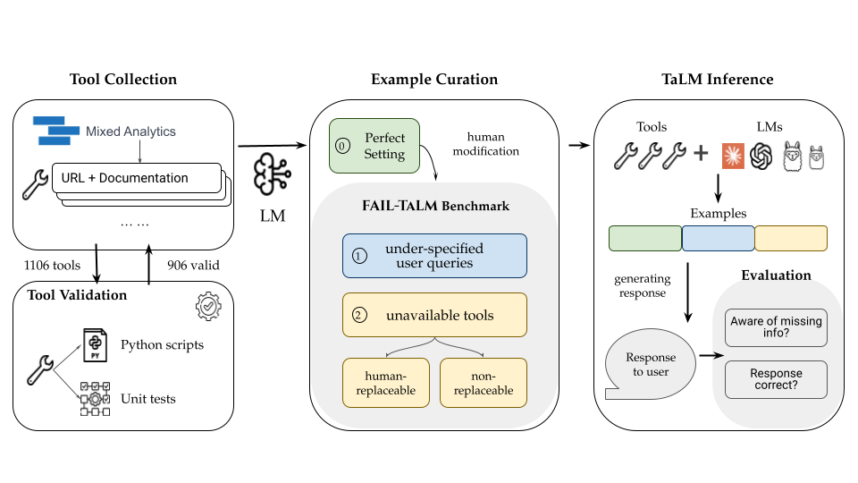

<p align="center">
  <!-- Placeholder for an image showcasing the benchmark or logo -->
  
</p>

<h1 align="center">⚙️ Fail-TaLMs Benchmark ⚙️</h1>

<p align="center">
  <!-- Example badge links; replace with your own if needed -->
  <a href="https://arxiv.org/abs/2503.14227"></a>
  <a href="assets/Benchmarking_Failures_in_Tool-Augmented_Language_Models_Paper.pdf"></a>
  <a href="assets/Benchmarking_Failures_in_Tool-Augmented_Language_Models_Poster.pdf"></a>
  <a href="https://github.com/EduardoTrevino/fail-talms"></a>
  <a href="./LICENSE"></a>
</p>

<p align="center">
  A benchmark and codebase for evaluating and experimenting with Tool-Augmented Language Models (TaLMs) <br>
  under real-world challenges such as unavailable tools and under-specified queries.
</p>

---

## **Latest News** 🔥

- **2024/12**: Our **Fail-TaLMs** benchmark and accompanying paper are officially released!
  - Introduces a large suite of **906 real-world tools** across **21 categories**.
  - Evaluates **three major** data settings: under-specified queries, unavailable tools, and perfect scenarios. 
  - Proposes the **Ask-and-Help (AAH)** method for real-time human interaction to handle missing details.
  - Check out our [paper](https://arxiv.org/abs/2412.03679) and [GitHub repo](https://github.com/EduardoTrevino/fail-talms).

---

## **What is Fail-TaLMs?**

<p align="center">
  <!-- Placeholder for another conceptual image -->
  
</p>

Tool-augmented language models (TaLMs) can solve complex tasks by calling external APIs. However, **real-world** usage often breaks the ideal assumptions:
1. Queries might lack necessary details (i.e., **under-specified**).
2. Critical **tools can become unavailable** or deprecated.

**Fail-TaLMs** is a benchmark that systematically measures performance of TaLMs under these realistic failure scenarios. 
We also introduce **Ask-and-Help (AAH)**, a method allowing the TaLM to interact with humans to request missing info or replace broken tools.

---

## 🔧 Installation

1. **Clone** the repository:
   ```bash
   git clone https://github.com/EduardoTrevino/fail-talms.git
   cd fail-talms
   ```
2. **Install** dependencies:
   ```
   pip install -r requirements.txt
   ```
3. (Optional) Set up environment variables (e.g., OPENAI_API_KEY, etc.) for your API usage.

---

## Project Structure 📁
Below is a high-level overview of our repository structure:
```
.
├── api_docs/
│   ├── {category_name}/
│   │   └── {tool_name}.txt     # Raw scraped docs for the API usage
│   └── ...
├── benchmark/
│   ├── no-tools/
│   │   ├── {category_name}/
│   │   │   └── queries...json   # Individual queries
│   │   └── all_no-tools_queries.json  # Collated queries
│   ├── non-replaceable/
│   ├── original/
│   ├── replaceable/
│   └── underspecified/
│       └── all_underspecified_queries.json
├── evaluation/
│   └── evaluation.py   # Evaluation of model outputs. Requires output json files.
├── generation/
│   ├── query_generation.py   # Generation of Queries. Requires Tool environment
│   └── tool_env_generation.py   # Generation of Tool environment. Requires API documentation
├── inference/   # TaLM's have their unique tool calling schema
│   ├── pipeline_gpt.py   # Inferencing pipelines, produces model output jsons. Requires tool environment, and queries
│   ├── pipeline_claude.py
│   └── pipeline_llama.py
├── outputs/
│   ├── no-tools/
│   │   ├── {model_name}/
│   │   │   └── answers.json
│   │   └── {model_name}AAH/
│   │       └── answers.json
│   ├── non-replaceable/
│   │   └── ...
│   ├── original/
│   │   └── ...
│   ├── replaceable/
│   │   └── ...
│   └── underspecified/
│       └── ...
├── runners/
│   ├── inference.bat   # Inferencing runners, runs pipelines. Set AAH flag, and other params
│   └── inference.sh
├── tools/
│   ├── {category_name}/
│   │   └── {tool_name}/
│   │       ├── api.py          # Endpoints for this tool
│   │       ├── api_test.py     # Unit tests & example parameters
│   │       └── raw_output.txt  # Raw LLM generation logs for the tool
│   ├── {tool_name}.json        # Function calling schema (JSON) representation
│   └── ...


```
### Key Directories
- #### tools/
  Contains generated Python endpoints (`api.py`) and test scripts (`api_test.py`) for each tool. Also hosts a `.json` descriptor (function calling schema) for each tool.
- #### api_docs/
  Raw API documentation collected for each tool. Organized into `{category_name}/{tool_name}.txt`.
- #### benchmark/
  Houses the benchmark data for 5 different data settings:

  1. no-tools
  2. non-replaceable
  3. original (perfect info and all tools available)
  4. replaceable
  5. underspecified
  
  Each setting contains subfolders for different categories and a combined `.json` file listing all queries.
- #### outputs/
  Evaluation results are stored in separate subdirectories for each data setting. Each subdirectory contains folders named after the model, with or without `AAH` (Ask-and-Help). Inside each model folder, you’ll find `answers.json` showing the model’s raw outputs.
- #### inference/
  Pipelines for inference, one Python script per model (e.g., `pipeline_gpt.py`), which define how to load the model, parse queries, and optionally handle the tool function-calling mechanism.
- #### evaluation/
  Includes `evaluation.py`, which calculates pass rates, awareness metrics, and other evaluations by reading `answers.json` from `outputs/`.
- #### runners/
  `.bat` files for quickly running inference with different models or toggling the AAH (Ask-and-Help) method. You can set flags for AAH usage and API keys.

---

## Usage Guide 🚀
### 1) Setup & Requirements
- Make sure to install all the necessary Python packages with `pip install -r requirements.txt`.
- You’ll need to specify your model access (e.g., API keys for GPT, Claude). Open-source LLaMa model usage also requires local model weights & environment setup.

### 2) Preparing the Benchmark
This repository includes 5 settings of data in the `benchmark/` folder:

1. #### original: Perfect scenario (fully specified queries and all tools available)
2. #### no-tools: Only the queries are provided, no tool information is given
3. #### underspecified: Key details missing from queries
4. #### replaceable: Tools needed are unavailable but trivially replaceable
5. #### non-replaceable: Tools needed are unavailable and not trivially replaceable

Each subdirectory has category folders (e.g., `Finance`, `Gaming`, etc.) and corresponding queries.

### 3) Inference
- You can run inference on the benchmark using the `.bat` scripts in `runners/`. For instance:
```
cd runners
./run_gpt.bat
```
- Inside each `.bat` file, you’ll see flags for:
  - AAH (Ask-and-Help) usage (true/false)
  - API Keys (e.g., `OPENAI_API_KEY`, etc.)
  - The data setting you wish to run (e.g., `underspecified`, `replaceable`)

- Alternatively, run the model-specific Python scripts in inference/. For instance:
```
python pipeline_gpt.py --data_setting underspecified --aah true --api_key <YOUR_API_KEY_PATH.txt>
```

### 4) Outputs
- After running inference, results will appear in `outputs/{data_setting}/{model_name}[/AAH]/answers.json`.
- For example, `outputs/underspecified/gpt-AAH/answers.json` would hold GPT's responses for the underspecified setting with the Ask-and-Help method.

### 4) Evaluation
- You can evaluate the predictions by running:
  ```
  python evaluation/evaluation.py
  ```
- The script loads all results from `outputs/` and prints metrics like pass rate, awareness, unexpected success, etc.

---

## Ask-and-Help (AAH) Method
Our **Ask-and-Help (AAH)** approach allows the model to explicitly ask a human for missing details or for a tool replacement.
- **Usage:** In pipeline_{model_name}.py, you can toggle this method on or off via a command-line argument or .bat script.
-  When **AAH** is true, the model is allowed to call a hypothetical “human tool” to fill in missing parameters or replicate a broken tool’s functionality.

---

## Example Query JSON
This snippet shows how queries are formatted with a list of potential APIs/tools:
```
[
    {
        "api_list": [
            {
                "category_name": "Finance",
                "tool_name": "coinlore",
                "api_name": "get_all_tickers",
                "api_description": "Retrieve tick data for multiple crypto coins, sorted by market cap.",
                "method": "GET",
                "required_parameters": [],
                "optional_parameters": [
                    {
                        "name": "start",
                        "type": "INTEGER",
                        "description": "The starting position for results.",
                        "default": "0"
                    },
                    {
                        "name": "limit",
                        "type": "INTEGER",
                        "description": "The maximum number of results to retrieve.",
                        "default": "100"
                    }
                ]
            },
            {
                "category_name": "Finance",
                "tool_name": "exchangerate",
                "api_name": "get_latest_exchange_rates",
                "api_description": "Fetches the latest exchange rates for a given base currency.",
                "required_parameters": [
                    {
                        "name": "base_currency",
                        "type": "STRING",
                        "description": "The base currency ISO 4217 code.",
                        "default": "USD"
                    }
                ],
                "optional_parameters": [],
                "method": "GET"
            }
        ],
        "query": "Can you provide a list of all cryptocurrencies ranked by their market cap and also give me the current exchange rates for the US dollar?",
        "relevant APIs": [],
        "query_id": 2
    }
]
```
The model or the pipeline script uses these tool definitions to call the correct endpoints.

---

## Citation
If you find our benchmark or method useful, please cite our paper:
```
@inproceedings{
anonymous2025benchmarking,
title={Benchmarking Failures in Tool-Augmented Language Models},
author={Eduardo Treviño; Hugo Contant; James Ngai; Graham Neubig; Zora Zhiruo Wang},
booktitle={The 2025 Annual Conference of the Nations of the Americas Chapter of the ACL},
year={2025},
url={https://openreview.net/forum?id=XgbcrhgR3C}
}
```

---

**Happy Benchmarking!** If you have any questions or issues, feel free to open an issue or pull request!

  
